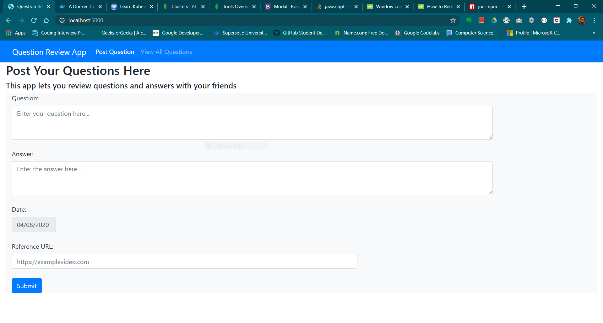
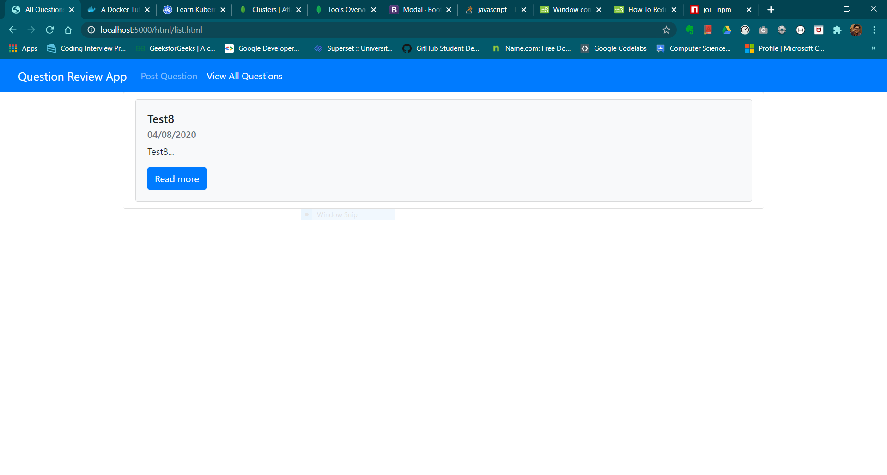
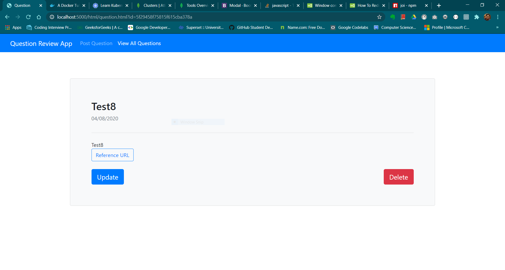

# Question Review App

This project consists of a simple web app utilising CRUD API made in Node.js + Express.js + MongoDB + Monk. The front-end is made with Bootstrap and JavaScript. The app allows you to post, update, view and delete Quora style questions and answers.


## Important Packages

* [express](https://www.npmjs.com/package/express)
  * Fast, unopinionated, minimalist web framework for node.
* [monk](https://www.npmjs.com/package/monk)
  * A tiny layer that provides simple yet substantial usability improvements for MongoDB usage within Node.JS.
* [mongodb](https://www.npmjs.com/package/mongodb)
  * The official [MongoDB](https://www.mongodb.com/) driver for Node.js. Provides a high-level API on top of mongodb-core that is meant for end users.
* [@hapi/joi](https://www.npmjs.com/package/joi)
  * The most powerful schema description language and data validator for JavaScript.

## Express CRUD API 

Includes API Server utilities:

* [morgan](https://www.npmjs.com/package/morgan)
  * HTTP request logger middleware for node.js
* [helmet](https://www.npmjs.com/package/helmet)
  * Helmet helps you secure your Express apps by setting various HTTP headers. It's not a silver bullet, but it can help!
* [dotenv](https://www.npmjs.com/package/dotenv)
  * Dotenv is a zero-dependency module that loads environment variables from a `.env` file into `process.env`

Development utilities:

* [nodemon](https://www.npmjs.com/package/nodemon)
  * nodemon is a tool that helps develop node.js based applications by automatically restarting the node application when file changes in the directory are detected.
* [eslint](https://www.npmjs.com/package/eslint)
  * ESLint is a tool for identifying and reporting on patterns found in ECMAScript/JavaScript code.
* [mocha](https://www.npmjs.com/package/mocha)
  * ☕️ Simple, flexible, fun JavaScript test framework for Node.js & The Browser ☕️
* [supertest](https://www.npmjs.com/package/supertest)
  * HTTP assertions made easy via superagent.

## Setup

First of all rename `.env.sample` to `.env` and set `MONGO_URI` to correct MongoDB database directory or `connection-string`.
See [this](https://docs.mongodb.com/manual/reference/connection-string/) for help. Then

```
npm install
```

## Lint

```
npm run lint
```

## Test

```
npm run test
```

## Development

```
npm run dev
```

## To Do

* Add User Authentication
* Support Markdown
* Add voting system
* Add [Disqus](https://blog.disqus.com/)

## Screenshots







## Reference

[Coding Garden](https://www.youtube.com/watch?v=EzNcBhSv1Wo)